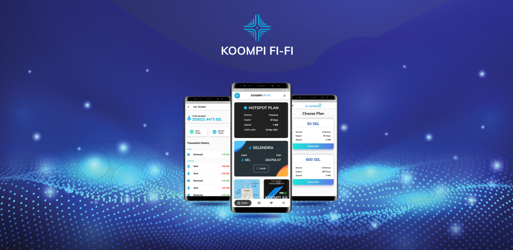
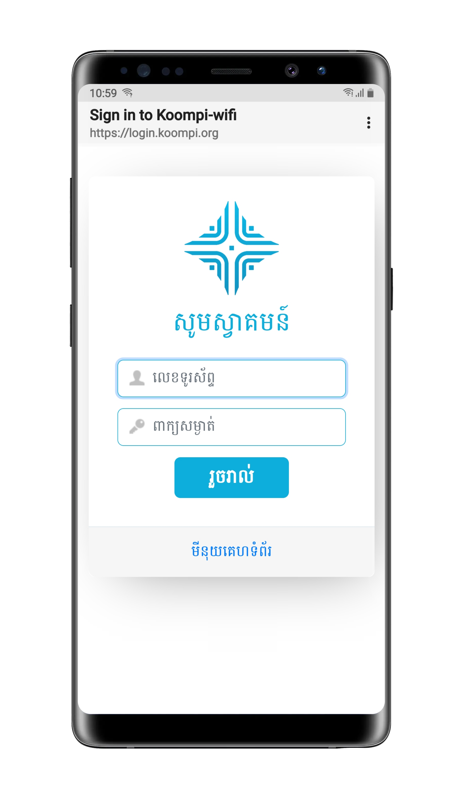
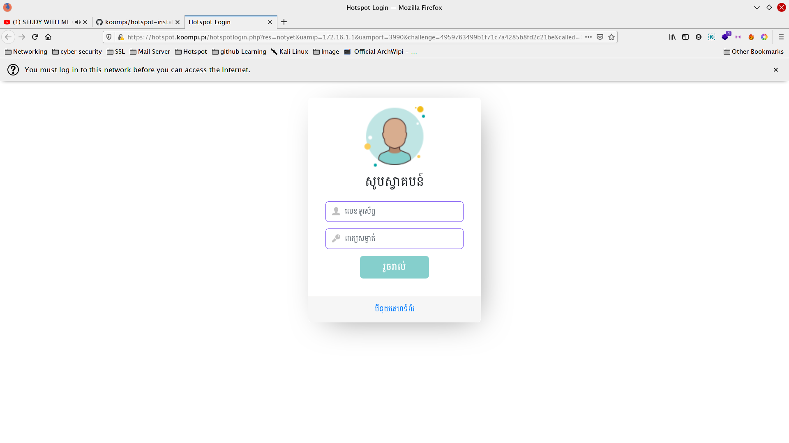

<h1 align="center">KOOMPI Fi-Fi</h1>

<p align="center">
  
</p>

## Introduction

KOOMPI Fi-Fi is a technology that connects millions of people to the internet, which means that they can connect to useful websites or social media. The internet is changing the way people and businesses communicate on a daily basis.

Today, we have wifi hotspots in coffee shops, hotels, and airports, and some parts in provinces. However, some remote areas don't have a secure and affordable internet connection. 

The KOOMPI Network Development team researched and developed KOOMPI Fi-Fi for those that don't have internet access for an affordable price. 
The internet allows small and large businesses to facilitate their work, utilize their time and store their files securely. 

Students may not be able to afford any internet hotspot despite their growing need to learn and research. KOOMPI Fi-Fi also provide secure storage and internet connection. Nowadays, we already deployed this project to Saang School. In the future, we hope more schools can connect to KOOMPI Fi-Fi. 

+ Mobile App

    Be wherever KOOMPI Wifi is set up and instantly connect! 
KOOMPI Hotspot is a mobile app that connects users to KOOMPI Wifi wherever it is available. 
Be among the first 2000 users to get two months of free KOOMPI Hotspot plan! 

+ Hotspot plans

    Users can purchase KOOMPI Hotspot plans using tokens from their wallet.
Users can choose between two hotspot plans: 30 days or 365 days. Each user can connect up to two devices at 5MB per device. 

<h2 align="center"></h2>
<p align="center">

</p><br>

Google PlayStore  
LINK: https://play.google.com/store/apps/details?id=com.koompi.hotspot

### Fix Bug

- [x] Fix user relogin after connect lost.
- [x] Can set time Accounting Request. 
- [x] Fix checking hotspot plan in database.
- [x] Fix message login error and message buy hotspot plan
- [x] Fix ssl HTTPS show error message.
- [x] Improve UI captive portal and script install.

### New Features

+  User access local website without login.

## Installation

**Requirement**

In order to build a captive portal solution, we will need the following:

+ Raspberry pi 4
+ Micro SD Card 16GB
+ Power Supply
+ Ethernet Cord or WiFi dongle (The Pi 3 and 4 has WiFi inbuilt)
+ Freeradius
+ PostgreSQL
+ Docker
+ Hostapd
+ CoovaChilli
+ Bind9
+ Nginx
+ PHP-FPM

**Optional**
+ Raspberry Pi Case

For this tutorial on installing KOOMPi FiFi, we used a Raspberry Pi 4 running the latest available version of Raspberry Pi OS.

**Preparing your Raspberry Pi for Install**

1. Before we start, let us ensure that our operating system is entirely up to date.

    To update everything, we need to type in the following two commands into the terminal.

    ```console
    $ sudo apt update
    $ sudo apt full-upgrade
    $ sudo reboot
    ```

2. Once your Raspberry Pi has finished updating, we can now install the KOOMPI Fi-Fi.

    ```
    $ git clone https://github.com/koompi/hotspot-installation.git -b server-client
    $ cd hotspot-installation && chmod +x install.sh
    $ ./install.sh
    ```

    It will need some information after you have finished it, wait until it is install done and then restart it.
    


3.  Configure PostgreSQL database for FreeRadius

    Open adminer to login postgreSQL:

    ```
    http://127.0.0.1:8088
    ```

    Enter a username and password when you first install. 
    
    After login create `radius` database. Generate database tables using postgresql schema by go to Import -> Broswe to file (in hotspot-installation/freeradius/3.0/mods-config/sql/main/postgresql/schema.sql) -> Execute.

    Go to "SQL command" and excute this sql command for add user.

    ```
    INSERT INTO radcheck (username ,attribute ,op ,value ) VALUES ('user0', 'MD5-Password', ':=', MD5( '123'));
    INSERT INTO radcheck (username ,attribute ,op ,value ) VALUES ('user5', 'Simultaneous-Use', ':=', '1');
    INSERT INTO radcheck (username ,attribute ,op ,value ) VALUES ('user5', 'Expiration', ':=', 'June 19 2020 12:52:00 +07');
    ```

    After config postgreSQL success, you need restart freeradius.

    ```
    $ sudo systemctl restart freeradius
    ```

    And now to test you use the command.

    ```
    $ radtest usertest passwd localhost 0 radtesting123
    ```

    And then you can connect to Wifi that you put name when you install first and test login captive portal.

<br><h2 align="center">Mobile Phone</h2>
<p align="center">

</p>

<br>
<h2 align="center">PC Computer</h2>
<p align="center">

</p>